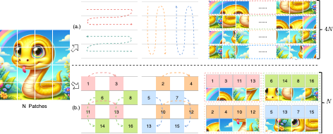
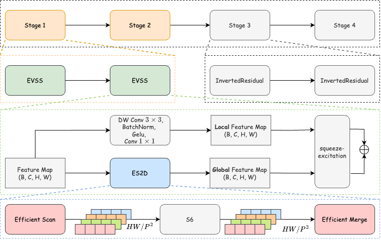

<div align="center">
<h1>EfficientVMamba </h1>
<h3>EfficientVMamba: Atrous Selective Scan for Light Weight Visual Mamba</h3>

[Xiaohuan Pei](https://github.com/TerryPei/EfficientVMamba)<sup>1</sup>,[Tao Huang](https://github.com/hunto/)<sup>1</sup>,Chang Xu<sup>1</sup>

<sup>1</sup>  University of Sydney 

Paper: ([arXiv 2401.10166](https://arxiv.org/abs/2403.09977))

<p align='center'>

</p>

</div>

## Updates

* **` Mar. 20th, 2024`:** Release training code for classification, working on updating to accelerate version.

* **` Mar. 20th, 2024`:** Code will be published in several days.


## Abstract

Prior efforts in light-weight model development mainly centered on CNN and Transformer-based designs yet faced persistent challenges. CNNs adept at local feature extraction compromise resolution while Transformers offer global reach but escalate computational demands $\mathcal{O}(N^2)$. This ongoing trade-off between accuracy and efficiency remains a significant hurdle. Recently, state space models (SSMs), such as Mamba, have shown outstanding performance and competitiveness in various tasks such as language modeling and computer vision, while reducing the time complexity of global information extraction to $\mathcal{O}(N)$. Inspired by this, this work proposes to explore the potential of visual state space models in light-weight model design and introduce a novel efficient model variant dubbed EfficientVMamba. Concretely, our EfficientVMamba integrates a atrous-based selective scan approach by efficient skip sampling, constituting building blocks designed to harness both global and local representational features. Additionally, we investigate the integration between SSM blocks and convolutions, and introduce an efficient visual state space block combined with an additional convolution branch, which further elevate the model performance. Experimental results show that, EfficientVMamba scales down the computational complexity while yields competitive results across a variety of vision tasks. For example, our EfficientVMamba-S with $1.3$G FLOPs improves Vim-Ti with $1.5$G FLOPs by a large margin of $5.6\%$ accuracy on ImageNet. Code is available at: [https://github.com/TerryPei/EfficientVMamba].


## Introduction
<p align='center'>

</p>

<!-- ## Overview

* [**VMamba**](https://arxiv.org/abs/2401.10166) serves as a general-purpose backbone for computer vision with linear complexity and shows the advantages of global receptive fields and dynamic weights.

<p align="center">
  
</p>

* **2D-Selective-Scan of VMamba**

<p align="center">
  
</p>

* **VMamba has global effective receptive field**

<p align="center">
  
</p> -->


## Main Results

We will release all the pre-trained models/logs in few days.

* **Classification on ImageNet-1K**

| name | pretrain | resolution |acc@1 | #params | FLOPs | checkpoints/logs |
| :---: | :---: | :---: | :---: | :---: | :---: | :---: |
| EfficientVMamba-T | ImageNet-1K | 224x224 | 76.5 | 6M | 0.8G | [-]/[[log]](https://github.com/TerryPei/EfficientVMamba/releases/download/v1.0.0/log_efficient_vmamba_tiny.txt)|
| EfficientVMamba-S | ImageNet-1K | 224x224 | 78.7 | 11M | 1.3G | [-]/[[log]](https://github.com/TerryPei/EfficientVMamba/releases/download/v1.0.0/log_efficient_vmamba_small.txt)|
| EfficientVMamba-B | ImageNet-1K | 224x224 | 81.8 | 33M | 4.0G | [-]/[[log]](https://github.com/TerryPei/EfficientVMamba/releases/download/v1.0.0/log_efficient_vmamba_base.txt)|


* **Object Detection on COCO**
  
| Backbone | #params | FLOPs | Detector | box mAP | mask mAP | checkpoints/logs |
| :---: | :---: | :---: | :---: | :---: | :---: |:---: |


* **Semantic Segmentation on ADE20K**

| Backbone | Input|  #params | FLOPs | Segmentor | mIoU | checkpoints/logs |
| :---: | :---: | :---: | :---: | :---: | :---: |:---: |


## Getting Started

### Installation

**The installation steps are the same as VMamba.**

**step1:Clone the VMamba repository:**

To get started, first clone the VMamba repository and navigate to the project directory:

```bash
git clone https://github.com/TerryPei/EfficientVMamba.git
cd EfficientVMamba

```

**step2:Environment Setup:**
The install
VMamba recommends setting up a conda environment and installing dependencies via pip. Use the following commands to set up your environment:
#### Create and activate a new conda environment

```bash
conda create -n vmamba
conda activate vmamba
```
#### Install Dependencies.
```bash
pip install -r requirements.txt
# Install selective_scan and its dependencies
cd selective_scan && pip install . && pytest
```


Optional Dependencies for Model Detection and Segmentation:
```bash
pip install mmengine==0.10.1 mmcv==2.1.0 opencv-python-headless ftfy
pip install mmdet==3.3.0 mmsegmentation==1.2.2 mmpretrain==1.2.0
```

### Model Training and Inference

**Classification:**

To train VMamba models for classification on ImageNet, use the following commands for different configurations:

```bash
# For Tiny
python -m torch.distributed.launch --nnodes=1 --node_rank=0 --nproc_per_node=8 --master_addr="127.0.0.1" --master_port=29501 main.py --cfg configs/vssm/vssm_efficient_tiny.yaml --batch-size 128 --data-path /dataset/ImageNet2012 --output /tmp

# For Small
python -m torch.distributed.launch --nnodes=1 --node_rank=0 --nproc_per_node=8 --master_addr="127.0.0.1" --master_port=29501 main.py --cfg configs/vssm/vssm_efficient_small.yaml --batch-size 128 --data-path /dataset/ImageNet2012 --output /tmp

# For Base
python -m torch.distributed.launch --nnodes=1 --node_rank=0 --nproc_per_node=8 --master_addr="127.0.0.1" --master_port=29501 main.py --cfg configs/vssm/vssm_efficient_base.yaml --batch-size 128 --data-path /dataset/ImageNet2012 --output /tmp

```

**Detection and Segmentation:**

For detection and segmentation tasks, follow similar steps using the appropriate config files from the `configs/vssm` directory. Adjust the `--cfg`, `--data-path`, and `--output` parameters according to your dataset and desired output location.


## Citation

```
@article{
}
```

## Acknowledgment
This project is based on VMamba [paper](https://arxiv.org/abs/2401.10166), [code](https://github.com/MzeroMiko/VMamba)
, Mamba [paper](https://arxiv.org/abs/2312.00752), [code](https://github.com/state-spaces/mamba), Swin-Transformer ([paper](https://arxiv.org/pdf/2103.14030.pdf), [code](https://github.com/microsoft/Swin-Transformer)), ConvNeXt ([paper](https://arxiv.org/abs/2201.03545), [code](https://github.com/facebookresearch/ConvNeXt)), [OpenMMLab](https://github.com/open-mmlab),
and the `analyze/get_erf.py` is adopted from [replknet](https://github.com/DingXiaoH/RepLKNet-pytorch/tree/main/erf), thanks for their excellent works.

## License  
This project is released under the [Apache 2.0 license](LICENSE).
